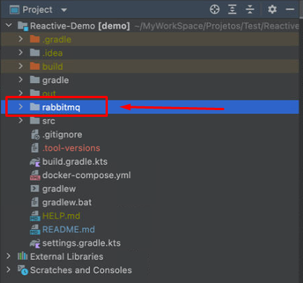
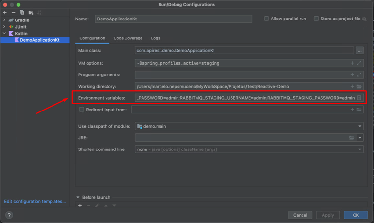
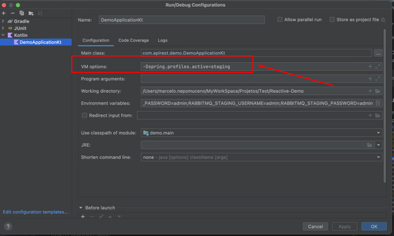

<h1 align="center">Reactive Demo Webflux</h1>

## Description
####Objective
In cooperativism, each member has one vote and decisions are taken in assemblies, by voting.

From there, you need to build a backend solution to manage these voting sessions.


This solution must run in the cloud and provide the following functionality through a REST API.

####Features
* Register a new agenda;
* Open a voting session on an agenda (the voting session must be open for a specified time in the opening call or 1 minute by default);
* Receive votes from members on agendas (votes are only Yes/No. Each member is identified by a unique id and can only vote once per agenda);
* Count the votes and give the result of the vote on the agenda.

### Prerequisites
- Gradle 7.4.2
- JDK 17
- Kotlin 1.6.10
- [Docker](https://www.docker.com/products/docker-desktop/)
- [Docker Compose](https://docs.docker.com/compose/install/)

### Git Flow
1. Create a branch from main
2. Open a PR and wait for approval to merge
3. After merged into the master, generate a tag following semantic versioning, to learn more, go to [link](https://imasters.com.br/codigo/versionamento-semantico-o-que-e-e-como-usar)

###Pre-Execution Requirements
1. Create a folder called `rabbitmq` in the project root, as shown below:




### Run the project

1. Run the command below in the project root, it will create an instance of MongoDB and Rabbitmq in the machine's docker.
```
docker-compose up -d
```


#### Intellij
1. Add the following environment variables, as per print:

```
   MONGO_STAGING_USERNAME=admin
   MONGO_STAGING_PASSWORD=admin
   RABBITMQ_STAGING_USERNAME=admin
   RABBITMQ_STAGING_PASSWORD=admin
```



2. Add the following command in VMOptions, as print:

```
-Dspring.profiles.active=staging
```



###URL Local
```
http://localhost:8080/
```

###URL Swagger
```
http://localhost:8080/swagger-doc/swagger-ui.html
```